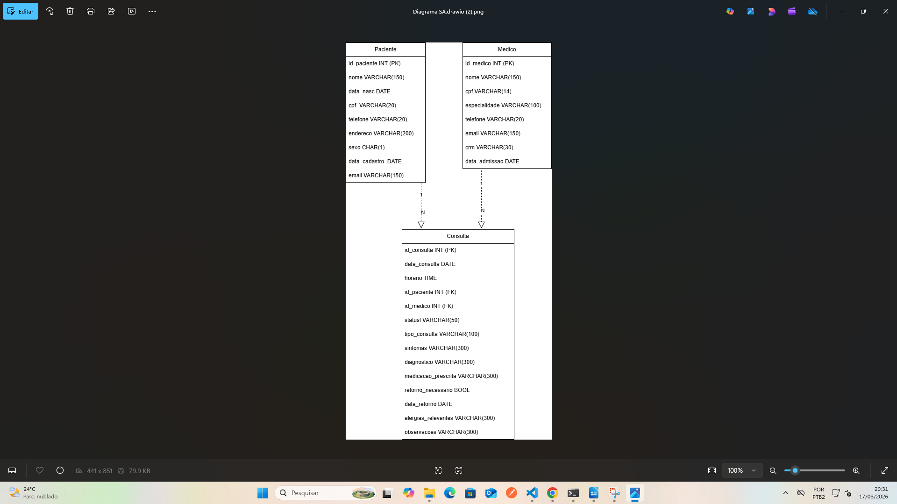
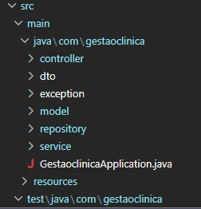
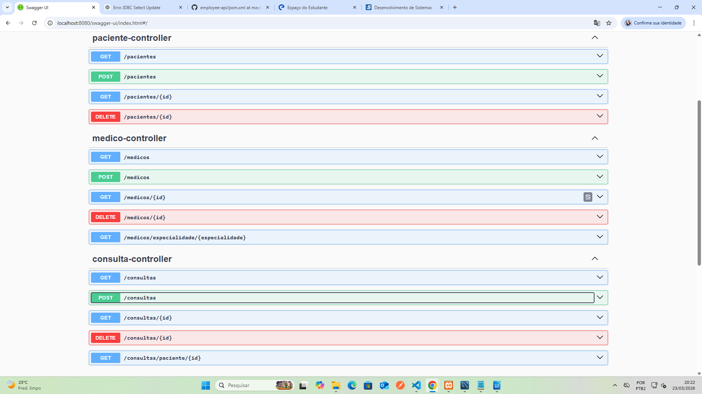

# 🏥 Sistema de Gestão Clínica

---

## 1. 📌 Descrição do Sistema

### 🔹 Contexto do Problema

A clínica utilizava anteriormente um sistema manual baseado em papel, no qual consultas eram registradas em agendas físicas.

Esse modelo apresentava diversos problemas:

* Dificuldade na organização dos horários
* Risco de perda de informações
* Falta de controle sobre consultas realizadas
* Possibilidade de conflitos de agendamento
* Baixa eficiência no atendimento

Com o aumento da demanda de pacientes, tornou-se necessária a informatização do processo.

---

### 🔹 Solução Desenvolvida

Foi desenvolvido um sistema de gestão clínica utilizando API REST, com o objetivo de:

* Cadastrar pacientes e médicos
* Realizar agendamento de consultas
* Controlar datas e horários
* Evitar conflitos de agendamento
* Garantir integridade e organização dos dados

---

### 🔹 Tecnologias Utilizadas

* **Java 17**
* **Spring Boot**
* **Spring Data JPA**
* **MySQL**
* **H2 Database**
* **Maven**
* **Swagger**

---

## 2. 🧩 Diagrama ER



### 🔹 Descrição

O sistema é composto por três entidades principais:

* Paciente
* Médico
* Consulta

A entidade **Consulta** atua como relacionamento entre Paciente e Médico.

---

## 3. 📂 Estrutura de Pacotes



### 🔹 Organização

* Controller → requisições HTTP
* Service → regras de negócio
* Repository → acesso ao banco
* Model → entidades
* DTO → transferência de dados

---

## 4. 🌐 Endpoints da API



### 🔹 Paciente

| Método | Rota            | Descrição          |
| ------ | --------------- | ------------------ |
| GET    | /pacientes      | Listar pacientes   |
| POST   | /pacientes      | Cadastrar paciente |
| PUT    | /pacientes/{id} | Atualizar paciente |
| DELETE | /pacientes/{id} | Remover paciente   |

---

### 🔹 Médico

| Método | Rota          | Descrição        |
| ------ | ------------- | ---------------- |
| GET    | /medicos      | Listar médicos   |
| POST   | /medicos      | Cadastrar médico |
| PUT    | /medicos/{id} | Atualizar médico |
| DELETE | /medicos/{id} | Remover médico   |

---

### 🔹 Consulta

| Método | Rota            | Descrição          |
| ------ | --------------- | ------------------ |
| GET    | /consultas      | Listar consultas   |
| POST   | /consultas      | Agendar consulta   |
| PUT    | /consultas/{id} | Atualizar consulta |
| DELETE | /consultas/{id} | Cancelar consulta  |

---

## 5. 📦 DTOs Utilizados

* Validação de dados de entrada
* Segurança da aplicação
* Evita expor entidades diretamente

Validações utilizadas:

* `@NotBlank`
* `@NotNull`
* `@Size`
* `@Email`

---

## 6. ⚙️ Regras de Negócio

* Não permite paciente sem nome
* Não permite CPF duplicado
* Não permite CRM duplicado
* Não permite consulta em data passada
* Não permite conflito de horário
* Campos obrigatórios devem ser preenchidos

---

## 7. 🧠 Desafio Implementado

Listar consultas de um paciente com dados do médico utilizando **Spring Data JPA**.

Exemplo conceitual SQL:

```sql
SELECT c.id_consulta, p.nome, m.nome
FROM consulta c
JOIN paciente p ON c.id_paciente = p.id_paciente
JOIN medico m ON c.id_medico = m.id_medico;
```

---

## 8. ▶️ Como Executar o Projeto

### 🔹 Pré-requisitos

* Java 17
* Maven
* MySQL

---

### 🔹 Passos

1. Criar banco:

```sql
CREATE DATABASE DB_GESTAO_CLINICA;
```

2. Executar o projeto

3. Acessar Swagger:
   http://localhost:8080/swagger-ui.html

---

## 9. 📌 Considerações Finais

O sistema substituiu o processo manual por uma solução automatizada, trazendo:

* Melhor organização
* Redução de erros
* Maior eficiência
* Controle de dados

---
